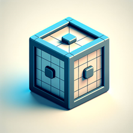

# WebGL2 движок для создания 3D-графики в браузере

Этот проект представляет собой практическое изучение WebGL 2.0 и разработку собственного 3D-движка с использованием современного синтаксиса ES6.

## Описание

В процессе изучения WebGL 2.0 и разработки этого проекта вы обретете знания и навыки, которые позволят вам создавать впечатляющие 3D-приложения для браузера, включая приложения для дополненной и виртуальной реальности. Этот проект является отличной отправной точкой для тех, кто желает исследовать возможности WebGL для создания 3D-графики в браузере.

Вы можете спросить - почему мы не используем одну из многих популярных библиотек, основанных на WebGL? Ответ прост. Создание собственного движка с нуля дает более глубокое понимание работы WebGL, что в свою очередь позволяет создавать более эффективные и оптимизированные приложения.
